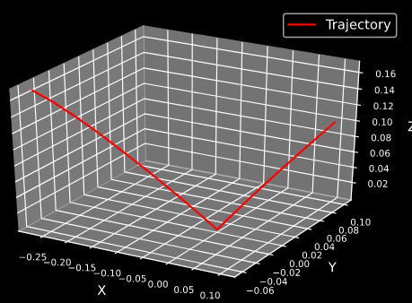

# Pinocchio Based Robot Solver
This repository implements Kinematics & Dynamics Solver for the robot 'nyu_finger' using the 'pinocchio libraries'.

1. "nyu_finger": https://github.com/open-dynamic-robot-initiative/nyu_finger
2. "pinocchio": https://github.com/stack-of-tasks/pinocchio

## Description
1. Rendering of the model in Meshcatviwer,
    <p align="left"></p>
2. Plotting Trajectories,
    <p align="left"></p>
3. Testing of Inverse Dynamic Compensation,
    <p align="left"></p>


## Dependencies
Install dependencies using:
```bash
pip3 install -r requirements.txt 
```
* Additionally, check the github links [1] & [2] for detailed installation instructions.

## Contact
* email: navale@is.mpg.de